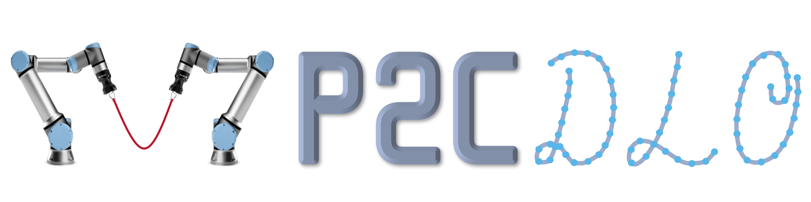
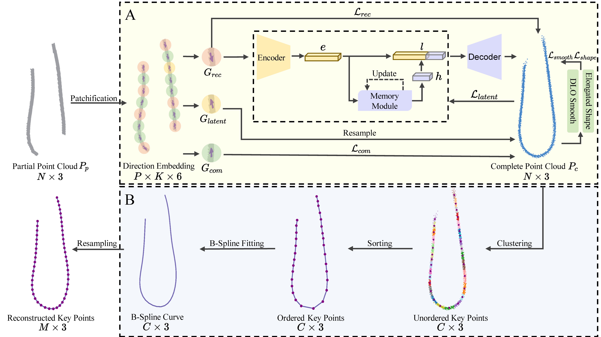

# MP2CDLO: Self-supervised Learning of Reconstructing Deformable Linear Objects under Single-Frame Occluded View<br>


## <center> Framwork

##### **A. Self-supervised DLO Point cloud completion, B. Ordered key points generation.**

## Introduction
[**MP2CDLO:Self-supervised Learning of Reconstructing Deformable Linear Objects under Single-Frame Occluded View**]<br>
Song Wang,Guanghui Shen,Shiru WU and Dan Wu

**[abstract]** <span style="color: rgb(3, 168,158); font-weight:bold">Deformable linear objects (DLOs)</span>,such as ropes, cables, and rods, are common in various scenarios, and <span style="color: rgb(3, 168,158); font-weight:bold">accurate occlusion reconstruction</span>of them are <span style="color: rgb(3, 168,158); font-weight:bold">crucial for effective robotic manipulation. </span>Previous studies for DLO reconstruction eitherrely on supervised learning, which is limited by the availability of labeled real-world data, orgeometric approaches, which fail to capture global features and often struggle with occlusions and complex shapes. This paper presents<span style="color: rgb(102, 8, 116); font-weight:bold">a novel DLO occlusion reconstruction framework</span> that integrates self-supervised point cloud completion with traditional techniques like clustering, sorting, and fitting to enerate ordered key points. <span style="color: rgb(102, 8, 116); font-weight:bold">A memory module</span> is proposed to enhance the self-supervised training process by consolidating prototype information, while <span style="color: rgb(102, 8, 116); font-weight:bold">DLO shape constraints </span>are utilized</span> to improve reconstruction accuracy. Experimental results on both synthetic and real-world datasets demonstrate that our method <span style="color: rgb(40,61, 126); font-weight:bold">outperforms state-of-the-art algorithms</span>, particularly in scenarios involving <span style="color: rgb(40,61, 126); font-weight:bold">complex occlusions and intricate self-intersections.</span>

## Update
- :raised_hands: 2024.09.15: The first version of code and dataset for MP2CDLO are released. The complete code for this project will be made publicly available upon acceptance of the paper. Now you can run our demo code to see the results.
- :rocket: 2024.09.13: This work has been submitted to **ICRA 2025** and is currently under review. For further information, please visit our project website: [MP2CDLO](https://mp2cdlo.github.io/MP2CDLO/).

## Installation
This code was tested on `Ubuntu 20.04` .
#### Requirements
- Python >= 3.7 (tested on 3.9)
- CUDA 11.7
- Pytorch >= 1.12
- open3d>=0.14.1
- transforms3d
- pytorch3d
- pyyaml
- opencv-python
- tensorboard
- tqdm
- timm==0.4.5
- scipy
- torch_kmeans
- geomdl
- bezier
- scikit-learn

#### Or you can setup the environment using `conda`:
- Create conda environments and active it.
```
conda create -n MP2CDLO python=3.9
conda activate MP2CDLO
```
- Install `torch1.13.0+cu117`.
```
pip install torch==1.13.0+cu117 torchvision==0.14.0+cu117 torchaudio==0.13.0 --extra-index-url https://download.pytorch.org/whl/cu117
```
- Download the package of pytorch3d and install.
```
https://anaconda.org/pytorch3d/pytorch3d/files
conda install https://anaconda.org/pytorch3d/pytorch3d/0.7.5/download/linux-64/pytorch3d-0.7.5-py39_cu117_pyt1130.tar.bz2
```
- Install the other packages using requirements.
```
pip install -r requirements.txt
```
#### Some packages are needed to train and evaluate the model.
- Pytorch Chamfer Distance
- pointops_cuda

To build this, run the command below:
```
python setup.py install --user
```
**Remember to delete the previous build files from other configurations! Compile from scratch in your own environment.**

## Preparing the Data


1. Rope dataset(generated by Issac sim Replicator) [[`Google Drive`](https://drive.google.com/file/d/1pq0lp8D54lBF9npg-YmXRExbDKM_DUDo/view?usp=sharing)] 

2. Please download the dataset to `./data/EPN3D_rope/`

**The layout should look like this**
```
├── cfgs
├── data [This is your dataroot]
│   ├── rope_dict.json
│   ├── EPN3D_rope
│   │   ├── EPN3D.json
│   │   ├── rope
│   │   │   ├── complete
│   │   │   │   ├── label_0000.npy
│   │   │   │   ├── ......
│   │   │   ├── partial
│   │   │   │   ├── pointcloud_0000.npy
│   │   │   │   ├── ......
```

## Training
To train our self-supervised DLO Point cloud completion model from scratch, run:

```
python train.py --config ./cfgs/EPN3D_models/MP2CDLO.yaml --exp_name your_exp_name
```

## Demo 

We provide pre-trained model weights on the real-world data.You can directly with the following code.
```
python ./demo/src/demo.py
```
 


## Acknowledgement
This code is standing on the shoulders of giants. 

We want to thank the following contributors that our code is based on:[Partial2Complete](https://github.com/CuiRuikai/Partial2Complete), [Dloftbs](https://github.com/PPI-PUT/cable_observer/tree/master) and [PoinTr](https://github.com/yuxumin/PoinTr).

We would like to extend our gratitude to [Kangchen Lv](https://github.com/Kangchen-Lv/DLO-perception), [Zhaole Sun](https://github.com/TheGoblinTechies/DLO-perception-pipeline) and [Ruikai Cui](https://github.com/CuiRuikai/Partial2Complete) for their invaluable guidance and contributions during the early stages of this project. Their expertise and assistance have been instrumental in driving the progress of this work.

